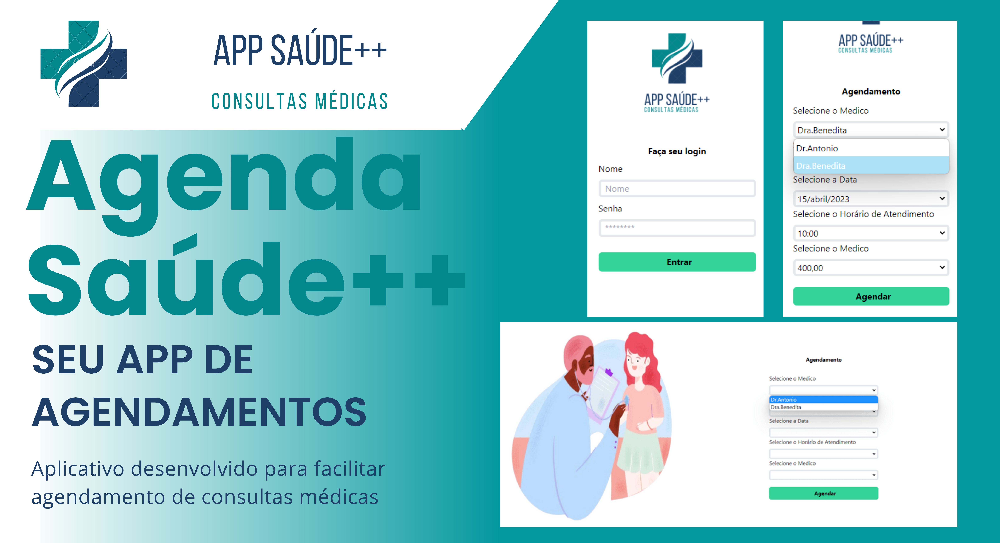

# 🌎 Apresentação do Projeto

APP para agendamento de consultas, aplicativo consiste em aumentar a qualidade de atendimento para as pessoas, trazendo maior comodidade na hora de marcar ou remarcar consultas médicas. Projeto também contribui no deslocamento das pessoas, economizando tempo e dinheiro.

O aplicativo é ligado diretamento aos dados de médicos, paciêntes e paciêntes dependêntes de outros, tendo assim uma tela de cadastro e login além da tela de agendamento.

APP está dísponível para mobile, desktop e tablet.

#### 🚀 Deploy
Ainda não realizado.


## 👨‍💻 Área do Desenvolvedor

Configurando seu ambiente de desenvolvimento.

### 🧬 Clone

Para iniciar clone o repositório, você pode optar pelas seguintes formas.

SSH:
```
git@github.com:HederAlves/APP-agendamento.git
```
HTTPS:
```
https://github.com/HederAlves/APP-agendamento.git
```
GiHub CLI:
```
gh repo clone HederAlves/APP-agendamento
```

### 🔧 Instalação

Após realizar o clone, com o projeto aberto, instale o pacote de dependências npm pelo terminal executando o comando:

```
npm install
```

#### ⚙️ Executando aplicação completa

Agora com tudo instalado vamos iniciar a aplicação você pode optar por utilizar o banco de dados fake ou não.
Caso deseje antes de iniciar a aplicação precisamos iniciar o nosso banco de dados, para isso execute em seu terminal o comando:
```
npx json-server --watch data/db.json
```
*_O Json.server vai segurar o endereço de API no localhost:3000 com seus endpoints para aplicação tarabalhar com dados._


Vamos então iniciar nossa aplicação, para isso em outro terminal dentro da mesma aplicação execute o comando:
```
npm run dev
```

#### ⚙️ Executando aplicação sem banco de dados fake
Agora com tudo instalado vamos iniciar a aplicação, para isso em seu terminal dentro da aplicação execute o comando: 
```
npm run dev
```

## 🛠️ Tecnologias utilizadas no desenvolvimento

* [Vue.js](https://vuejs.org/) - Framework JavaScript
* [TailwindCSS](https://tailwindcss.com/) - Framework CSS
* [npm](https://www.npmjs.com/) - Dependência

## 🏛️Bibliotecas utilizadas no desenvolvimento 

* [Axios](https://axios-http.com/ptbr/) - Client HTTP
* [Vue.js](https://router.vuejs.org/) - Vue Router
* [npm](https://www.npmjs.com/package/json-server) - Json.server DB-fake

#### 📌 Versões

🚧 Em desenvolvimento...🚧


## 🙋 Desenvolvedor


